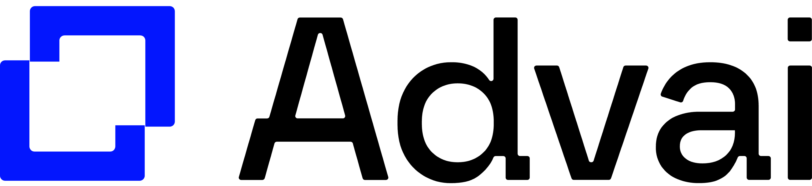

# Advai Autograd Challenge

## Overview
This coding challenge is designed to assess problem-solving skills and your ability to write clean, modular code. Your task is to implement autograd functionality in NumPy to train a simple neural network.

We have provided a reference neural network implemented in Torch, along with a predefined loss and a sample input vector. Use these tools to verify your solution, but remember that the main goal is to implement autograd without using PyTorch or TensorFlow.

## Submission
Please ensure your code is easy to install and run. Focus on writing clear, well-documented code.

Good luck!
